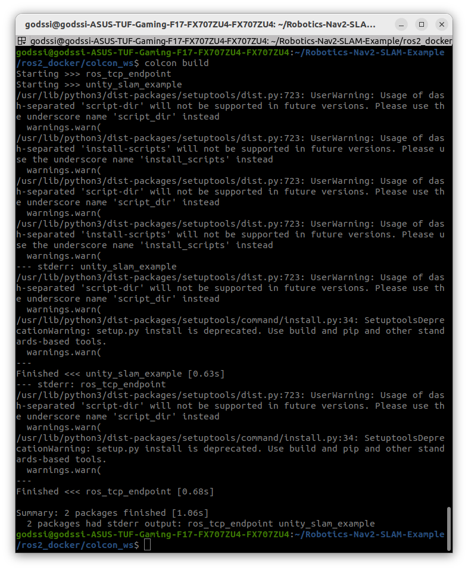

# MOIRO-KAIROS/Unity_Simulation

## Unity Simulation with ROS2
- Digital Twin 실현을 위한 유니티 시뮬레이션

## 환경세팅
- Ubuntu 22.04, ROS2-Humble (Intel)

ROS2를 이용하여 만든 코드를 시뮬레이션하기 위해서 사용하는  Program

- Unity 설치
    
    지원하는 Ubuntu Linux version : 18.04, 20.04, **22.04**
    
    1. 사전 설치: Linux에서 Unity를 설치하기 위해서, libssl1을 수동 설치
        
        ```jsx
        wget http://archive.ubuntu.com/ubuntu/pool/main/o/openssl/libssl1.1_1.1.1f-1ubuntu2_amd64.deb
        sudo dpkg -i libssl1.1_1.1.1f-1ubuntu2_amd64.deb
        ```
        
    2. Unity Hub repository 추가
        
        ```jsx
        sudo sh -c 'echo "deb https://hub.unity3d.com/linux/repos/deb stable main" > /etc/apt/sources.list.d/unityhub.list'
        ```
        
    3. Public Signing key 추가
        
        ```jsx
        wget -qO - https://hub.unity3d.com/linux/keys/public | sudo tee /etc/apt/trusted.gpg.d/unityhub.asc
        ```
        
    4. Package Update 및 Installation
        
        ```jsx
        sudo apt update
        sudo apt-get install unityhub
        ```
        
    5. Unity-Hub Uninstallation
        
        ```jsx
        sudo apt-get remove unityhub
        ```

    - 주의할 사항:
        Robotics-Nav2-SLAM[ROS2-Unity] - https://informluke.tistory.com/entry/Robotics-Nav2-SLAMROS2-Unity

            위의 해당링크에서 4번 항목에서 `sudo apt install ros-foxy-nav2-bringup`가 아니라 `sudo apt install ros-humble-nav2-bringup`
        
- Unity with ROS2
    1. Set Up the ROS2 Environment
        - Install the Unity Editor : 2020.3.11f LTS 버전의 Unity을 기준으로 함
        - 해당 [링크](https://github.com/Unity-Technologies/Robotics-Nav2-SLAM-Example)에서 Download ZIP을 눌러 다운로드한 후 파일 압축 해제
        - ROS-TCP-Endpoint는 따로 설치해야함. https://github.com/Unity-Technologies/ROS-TCP-Endpoint - **branch**: main-ros2로 변경 필요
            
        - 폴더 내 ‘ros2_docker/colcon_ws’로 이동 후,  `colcon build`
            - 오류 메세지
                
                  
                
            - `colcon build` 오류 해결 방법
                1. 패키지 버전 맞추기
                    
                    ```jsx
                    pip install setuptools==58.2.0
                    ```
                    
                2. 두 파일 수정: 언더바로 변경 ( - → _ )
                    - src/ROS-TCP-Endpoint/setup.cfg
                    - src/unity_slam_example/setup.cfg
                    - 수정 예시
                        
                        ```jsx
                        [develop]
                        script_dir=$base/lib/unity_slam_example
                        [install]
                        install_scripts=$base/lib/unity_slam_example
                        ```
                        
## 실행하기

Unity + turtlebot3가 잘 연동되는지 확인하기 (Option1 또는 **Option 2** 중 하나 시도해보기)

- 추가세팅: Game 윈도우 (FULL HD, Scale 1x)로 고정해놓기

- Unity + RViz로 움직이기 (Option 1)
    1. Unity 프로젝트 실행(play)하기
    2. Unity 실행 동시에, RViz 실행하기 [참고링크](https://github.com/Unity-Technologies/Robotics-Nav2-SLAM-Example/blob/main/readmes/run_example.md)
        
        ```jsx
        # 현재 위치는 'ros2_docker/colcon_ws' 에 있어야 함
        source install/local_setup.bash
        ros2 launch unity_slam_example unity_slam_example.py
        ```
        
        - RViz 내 세팅
            -   Global_Options/Fixed_Frame 변경
            -   Map/Topic: /global_costmap/cos...
            -   Map/Update_Topic: /global_costmap/cos...

        - Unity 내 터틀봇 움직이기 by RViz - 움직이는 건 Unity에서 확인
            
- Unity + 터미널에서 topic으로 움직이기 (Option 2)
    - [참고 페이지](https://github.com/Unity-Technologies/Robotics-Nav2-SLAM-Example/blob/main/readmes/unity_viz.md)
        
    1. Unity에서 Scene에 DefaultVisualizationSuite 추가하기
        
    2. 명령어 실행 후, Unity 씬도 play하고 있는지 확인 (안되고 있다면, play 버튼 누르기)
        
        ```jsx
        ros2 launch unity_slam_example unity_viz_example.py
        ```
        
    3. 토픽 명령어 내리기 (1 또는 2 명령어 중 하나를 선택하여 실행하기)
        
        ```jsx
        // 좌표를 지정하는 방식, 1
        ros2 topic pub -1 /goal_pose geometry_msgs/PoseStamped "{header: {stamp: {sec: 0}, frame_id: 'map'}, pose: {position: {x: 0.0, y: -4.0, z: 0.0}, orientation: {w: 1.0}}}"
        // 키보드로 움직이고 싶면, 2
        ros2 run turtlebot3_teleop teleop_keyboard
        ```
    
- Unity Camera : TurtleBot3 FollowCamera 적용하기
    - Assets/Scripts/FollowCam.cs 에 위치
        
        [FollowCam.cs](https://prod-files-secure.s3.us-west-2.amazonaws.com/319b0dd3-1565-4c4f-9cc3-5c5a9cb98be9/1f4ea31d-6064-4cfd-a074-afa573f0f55b/FollowCam.cs)
        
    - 씬 설정 - script 관련
        - Main Camera에서 기존의 script인 FreeCam은 비활성화시키고, FollowCam 추가하기
            - FollowCam의 Trutlbot3는 base_footprint로 설정